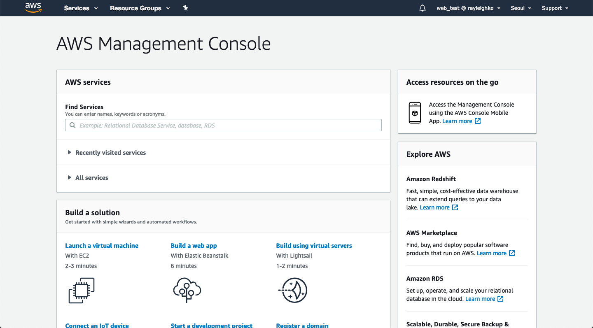
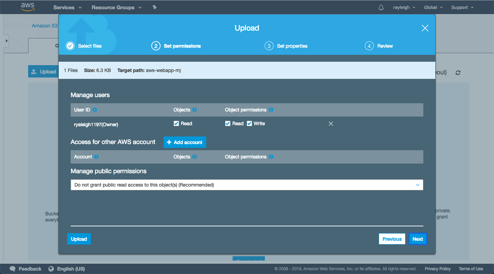

Training일단 이 글을 읽는 이들은 다음과 같은 조건을 충족했다고 가정한다.

- [이전 글(이론)](./README.md)을 읽었다.
- AWS 계정이 있다(Free tier가 아니여도 무관하다).
- 루트 계정이 아닌 유저 계정으로 콘솔에 접속했다(루트 계정은 이메일로 되어있는 계정을 말하고 유저 계정은 관리자가 정한 계정을 말하는데, 루트 계정으로 작업을 하게 되면 보안에 취약할 수 있으니 반드시 유저 계정을 따로 생성하길 바란다).
- 과금이 발생할 수 있음을 인지하고 있다.

여기서 우리는 다음의 5가지(크게 7가지) 서비스를 사용해볼 것이다.

- EC2(ELB, Auto-Scaling)
- RDS
- S3
- CloudFront
- Route 53

이제 어떻게 구현하면 좋을지 생각해보자. 먼저 EC2를 만들고, html로 랜딩 페이지를 띄우고, 이를 ELB로 로드밸런싱할 것이다. 더불어 S3에는 이미지를 저장하고, 이를 CloudFront로 정적 이미지를 제공해줄 것이다. 이때 데이터베이스는 RDS에서 MySQL로 제공할 것이고, 결과적으로 오토 스케일링이 가능라도록 구현하고자 한다. 나는 이를 가장 쉽게 설명하고 있는 [Getting Started with Linux Web Applications in the AWS Cloud](https://aws.amazon.com/web-applications/gsg-webapps-linux/)을 따라 만들어 볼 것이다!

만약 필자와 같은 선택을 할 것이라면 본격적으로 실습을 진행해보자. 내가 이 글을 쓰는 지금(2019. 02. 26)의 AWS 콘솔의 첫 페이지는 다음과 같다.



여기서 예제의 처음에 등장하는 S3 버킷을 생성해보자. 예제의 영상은 오래 되었지만, 그 동작은 변함이 없다. 검색란에서 S3를 검색해 'aws-webapp'이라는 bucket을 서울 리전에 만들어보자(S3는 생성 시 리전을 고를 수 있다).


Create bucket을 눌러 아래와 같이 'aws-webapp'이라는 버킷을 만들자(버킷은 이름의 중복을 피해야 한다. 가령 다른 사람이 aws-webapp을 사용하고 있다면 그 이름을 사용할 수 없다. 그래서 나는 aws-webapp-mj라는 버킷을 만들었다).


Copy할 버킷이 없으므로 다음으로 넘어가자. 다음으로 넘어가게 되면 다양한 속성들을 설정할 수 있는데, 만약 사용할 기능이 있다면 체크해도 좋지만 나는 여기서 따로 사용할 기능이 없기 때문에 Tags에 Name이라는 key를 webapp으로 만들어주고 다음으로 넘어갈 것이다.


다음으로 넘어가게 되면 다시 한 번 체크 박스가 나온다. 여기서도 사용자의 필요에 따라 체크를 하지 않을 수 있지만, 권장 사항이기 때문에 체크하고 넘어가는 것이 바람직할 것 같다. 더불어 Manage system permissions는 S3 로그 전달 그룹(Delivery group)에 이 버킷의 로그가 쓰여지는 것을 허용할 것이냐는 말인데, 지금 당장 로그 정보가 필요없으니 허용하지 않고 넘어갈 것이다.


마지막으로 지금까지의 설정을 확인하고 되묻는데, 여기서 제대로 설정했는지를 확인하고 생성을 마치도록 하자.


다음으로 예제가 설명하고 있는 것은 CloudFront인데, 이 동영상의 링크가 잘못된 것인지 EC2를 생성하는 예제를 설명한다. 따라서 나는 [CloudFront 시작하기](https://docs.aws.amazon.com/ko_kr/AmazonCloudFront/latest/DeveloperGuide/GettingStarted.html)라는 AWS CloudFront 튜토리얼을 읽어야만 했다.

우선은 CloudFront를 사용하기 위해선 앞선 설명처럼 S3의 버킷이 생성되어 있어야 하고, 컨텐츠가 업로드되어 있으며 객체 권한이 부여되어 있어야 한다.

이를 위해 해당 문서의 **Amazon S3에 콘텐츠를 업로드하고 모두에게 읽기 권한을 부여하는 방법**을 따라 S3의 설정을 진행하도록 하자. 우리는 "6. **버킷** 창에서 버킷을 선택하고 **업로드**를 선택합니다."부터 진행하면 될 것이다.


업로드 시 유의해야 할 사항은 읽기와 쓰기 권한의 설정이다. 필자의 이미지는 S3를 필자의 AWS계정에서만 사용 가능하도록 설정할 것이다. 더불어 여기서는 암호화 또는 태깅과 같이 객체에 원하는 속성을 설정할 수 있는데, 이는 사용자가 알맞게 사용하면 된다.



다음으로 넘어가면 다시 여러 속성을 만날 수 있는데, 나는 기본 세팅 그대로 설정해주고 넘어가도록 할 것이다(지금 당장 필요가 없는 설정이기도 하고 귀찮기 때문).


이로써 필자는 S3에 파일을 업로드할 수 있었다. 이처럼 업로드가 완료된 파일은 URL을 통해 접근할 수 있는데 필자의 경우 다음과 같은 URL로 파일에 접근할 수 있을 것이다.

> s3://aws-webapp-mj/40321838.png
>
> 혹은
>
> https://s3.ap-northeast-2.amazonaws.com/aws-webapp-mj/40321838.png

다음으로는 CloudFront 배포를 만들 것이다. CloudFront 배포를 만들려면 문서의 과정을 거쳐야 하는데, 그 중 가장 먼저 할 것은 CloudFront의 콘솔을 열어 **[Create Distribution]**을 선택한 후, [**Select a delivery method for your content**]의 [**Web**] 섹션에서 [**Get Started**]를 선택하는 것이다. 이 과정은 내가 따로 적을 필요없이 [문서](https://docs.aws.amazon.com/ko_kr/AmazonCloudFront/latest/DeveloperGuide/GettingStarted.html)에 매우 잘 나와있기 때문에 문서를 참고하도록 하자.

나는 S3를 설정한 것 외에는 전부 기본값을 사용해서 다음과 같은 CloudeFront Distributions(배포판)을 만들었다.


다음 과정은 링크 테스트인데, 이는 다른 곳에서 클라우드 프론트를 통해 나의 S3안에 있는 파일에 접근할 수 있는지를 확인하는 것이다. 이를 html로 다음과 같이 나타내보자.

```html
<html>
  <head>
    My CloudFront Test
  </head>
  <body>
    <p>My text content goes here.</p>
    <p></p>
  </body>
</html>
```

<p>My text content goes here.</p>
<p>

html의 문법을 마크다운에서도 사용할 수 있으니 직접 삽입해봤는데, 잘 나오지 않는다. 그 이유는 경로가 제대로 설정되지 않았거나, 마크다운에서는 부를 수 없다거나, 처리가 이루어지기 위한 생성 후 20분 ~ 40분의 시간이 지나지 않았기 때문일 것이기 때문에 우선은 가장 후자의 경우를 산정하여 마냥 기다려보기로 하자. 만약 이 글을 읽고 있는 와중에 위의 이미지가 잘 나온다면 제대로 경로를 설정한 것이고, 마크다운에서도 사용 가능하다는 것을 의미한다고 이해하도록 하면 좋을 것이다.

> 일정 시간이 흘러도 나타나지 않아 오류 메시지를 확인해보니 "AccessDenied"라는 오류가 발생하고 있었다. 이는 접근할 수 있는 권한이 없다는 의미인데, 이는 설정에서 JSON-based access policy의 설정을 변경해줘야 한다. 하지만 이는 돌이킬 수 없을 수 있으니 그냥 나중에 EC2에서 각자의 AWS 계정에서 파일을 불러오도록 하는 것으로 방향을 바꿔야겠다.
>
> 만약 S3의 파일을 공개하고 싶다면 S3 버킷을 설정할 때 봤던 권장사항들의 일부를 변경해주어야 한다. 이 점 참고하길 바란다.

여기까지 클라우드 프론트를 설정했다. 하지만 우리는 우리의 서비스가 하나의 아키텍처로 동작하는 것을 바라고 있다. 이제부터는 이를 위해 EC2와 RDS를 설정하는 작업을 진행할 것이다.

EC2의 경우에는 웹 서버와 애플리케이션 서버로 나누어줘야 하지만, 서비스가 없는 상황에서는 무리한 것 같아 간단하게 1개의 EC2를 index.html에 위의 문장을 삽입해 띄울 것이기 때문에 크게 어려움을 느끼지 않아도 될 것이다. 더불어 RDS에서는 MySQL을 사용해 데이터베이스에 파일의 id와 S3 주소를 저장하는 것으로 사용을 마무리할 것이기 때문에 역시 어렵지않게 이해할 수 있을 것이다.

우선 Auto Scaling과 ELB를 설정하도록 하자. 이를 위해서는 EC2 인스턴스를 만들어야 하는데, 그 과정은 [Amazon EC2 시작하기](https://aws.amazon.com/ko/ec2/getting-started/)의 2번 과정인 "2단계: Amazon EC2 인스턴스 시작"부터 진행하면 된다.

> 그 과정에서는 Auto Scailng Group을 만들 수 있는데, 이는 아래의 이미지를 통해 찾아보고 이를 설정하도록 하자.


저기서 파란색 버튼을 누르게 되면, 인스턴스 생성 이후에 자동으로 Auto Scaling Group 생성으로 넘어갈 수 있다. 여기에서는 그룹 이름과 서브넷을 설정해야 하는데, 서브넷은 되도록 인스턴스와 같은 곳으로 설정하는 것이 좋을 것 같다. 그리고 나서는 Key의 Name을 추가한 뒤 나머지는 기본 설정으로 하고 넘어가도록 하자(Auto Scaling 설정에서 인스턴스 수의 Min과 Max를 조절할 수 있다. 만약 필요하다면 자신에게 맞도록 설정하도록 하자).

> ap-northeast-2a에 EC2 인스턴스가 있다면, ap-northeast-2a로 서브넷을 설정하는 것이 혹시 모를 위험 요소를 배제할 수 있고, 직관적으로 구현할 수 있을 거라고 생각하기 때문이다. AWS의 일부 서비스는 가용 영역이 달라지면 서로 연동되지 않는 것들이 있다는 점을 유의하도록 하자.
>
> 더불어 만약 인스턴스를 먼저 만들고, Auto Scaling 그룹을 따로 만들고자 한다면 Security Group에서 Auto Scaling 설정에 대한 그룹을 생성해주면 된다.


인스턴스를 만들었고, ssh를 이용해 콘솔을 통해 인스턴스에 접근했다면, 홈 디렉터리(ssh로 접속한 바로 그 지점(~))에서 index.html이라는 문서를 만들어 앞선 html을 입력하도록 하고 각자가 원하는 웹 서버(필자는 nodejs로 만들 것이다)를 실행하도로 하자.

이제 대망의 ELB 설정이 남아있다. ELB를 설정하기 위해서는 EC2 내에서 Elastic IPs로 고정 IP를 발급받아 만들어진 인스턴스에 적용하고, Load Balancers로 로드 밸런싱을 통해 유입에 따른 인스턴스 설정을 해주어야 한다. 이 작업은 [자습서: 클래식 로드 밸런서 생성](https://docs.aws.amazon.com/ko_kr/elasticloadbalancing/latest/classic/elb-getting-started.html)를 통해 진행하도록 하자.

(작성중...)
