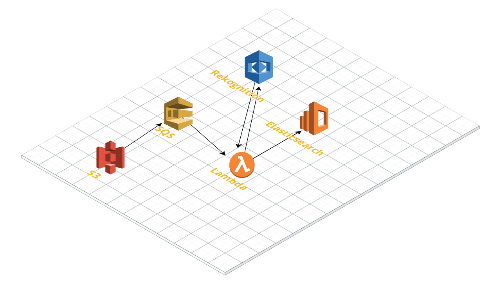

# Machine learning with Amazon Rekognition and Elasticsearch


## 0. 개요
본 가이드는, 다음 [Link](https://www.skedler.com/blog/machine-learning-amazon-rekognition-elasticsearch/)의 아키텍처를 Node.js, AWS Lamda, Amazon Elasticsearch를 사용해 재구성한 심플 가이드 입니다.
 
<h3><b>소량의 과금이 될수도 있으니 유의하시길 바랍니다. 프리티어 지원내용을 살펴보시기 바랍니다.
<br>또한, IAM 계정 활용은 다루지 않으며, 버킷 정책 설정에 대해서도 상세하게 다루지 않으니 보안에 유의하시기 바랍니다.
<br>반드시 가이드를 따라하신 뒤 바로 삭제하시기 바랍니다.</b></h3>

## 1. 아키텍처 시나리오
1. S3에 이미지가 생성되는 이벤트가 발생한다.
2. S3에 저장된 이미지 객체의 정보를 SQS에 등록한다.
3. SQS가 Lambda 함수를 트리거하여 Lambda함수에 큐에 있는 데이터를 전달한다.
4. Lamda는 받은 데이터에서 객체의 정보를 Rekognition에 전달한다(이미지 파일이 아닌, S3 객체의 주소만 보내도 됩니다).
5. Lamda는 Rekognition으로 부터 받은 분석 데이터를 Amazon Elasticsearch에 저장한다.
6. Amazon Elasticsearch가 제공하는 Kibana를 통해 저장된 데이터를 확인한다.

## 2. 가이드
본 가이드는 서울리전(ap-northeast-2)을 기준으로 작성되었습니다.

아래 언급되지 않는 항목들은 기본값을 사용합니다.

### 1. Elasticsearch 생성하기
1. Amazon Elasticsearch 콘솔에서 아래 내용과 같이 새 도메인을 생성합니다.
2. 배포 유형 선택
    - 배포 유형 선택 : 개발 및 테스트
    - 버전 : 6.4
3. 클러스터 구성    
    - 도메인 이름 : 임의로 입력하세요
    - 인스턴스 유형 : t2.small.elasticsearch
    - 인스턴스 개수 : 1
4. 액세스 설정
    - ***보안을 위해서는 VPC설정, 액세스 정책, Cognito 인증 등을 사용하여야 합니다. 이 가이드에서는 Kibana의 편리한 접근을 위하여 퍼블릭 액세스로 설정합니다. 자세한 내용은 [AWS 도큐먼트](https://docs.aws.amazon.com/ko_kr/elasticsearch-service/latest/developerguide/what-is-amazon-elasticsearch-service.html)를 살펴보시길 바랍니다.***
    - 네트워크 구성 : 퍼블릭 액세스
    - 액세스 정책
        - 도메인 액세스 정책 설정 : 도메인에 대한 개방 엑세스
5. 도메인 생성은 다소 시간이 걸리니 다음 가이드를 진행하시기 바랍니다.

### 2. SQS 생성 및 S3 이벤트 연동하기
1. SQS 콘솔에서 다음과 같이 대기열을 생성합니다. 
2. 대기열 이름 : 임의로 입력하세요
3. 표준 대기열 선택 및 **대기열 빠른 생성** 클릭
4. SQS 생성 확인 후 S3 콘솔 접속
5. S3 버킷 생성하기
6. 생성한 버킷의 arn 주소를 복사해 놓습니다.
7. SQS 콘솔 접속
8. 생성한 SQS 선택 -> 하단의 권한 탭 클릭 -> 권한 추가 클릭
9. 권한추가 창
    1. 효과 : 허용
    2. 프린시펄 : 모든사람(*)
    3. 작업 : SendMessage
    4. 조건추가(선택사항)
        1. 한정어 : 없음
        2. 조건 : StringEquals
        3. 키 : aws:SourceArn
        4. 값 : 앞서 복사한 S3의 arn 주소
        5. 조건추가
    5. 권한 추가
10. S3 콘솔 접속
11. 버킷 클릭 -> 속성 탭-> 이벤트 클릭
12. **알림 추가** 클릭
    1. 이벤트 이름 입력
    2. 이벤트 : 모든 객체 생성 이벤트
    3. 전송대상 : SQS 대기열
    4. SQS : 앞서 생성한 SQS 이름 선택
    5. **저장**


### 3. AWS Lambda 생성 및 Rekognition, ElasticSearch 연동
1. Lambda 콘솔에 접속합니다.
2. **함수 생성**
3. 함수이름 입력
4. 런타임 : Node.js 8.10
5. 실행역할 : AWS 정책 템플릿에서 새 역할 생성
    1. 역할이름 : 임의로 입력
    2. 정책 템플릿 : Elastic 권한, Amazon S3 객체 읽기 전용 권한 선택
6. 함수 생성
7. 실행역할 -> 기존역할 -> IAM 콘솔에서 **<역할이름> 역할을 확인** 하십시오 클릭
    1. **정책연결** 클릭
    2. AmazonSQSFullAccess, AmazonRekognitionFullAccess 선택 및 연결
    3. 람다 콘솔 새로고침
8. 트리거 추가 목록에서 SQS 트리거 클릭
    1. SQS 대기열 : 생성한 SQS 선택
    2. 배치 크기 : 1
    3. 트리거 활성화 : 체크
    4. 추가
    5. 람다 변경사항 저장
9. 함수코드 -> 코드 입력 유형 -> .zip 파일 업로드 -> 업로드 -> archive.zip 파일 업로드
10. 람다 변경사항 저장
11. Lambda 내부 에디터로 코드 수정
    1. elasticsearch.js 파일을 엽니다.
    2. 파일 상단의 다음 코드를 수정하고 저장합니다.
    ```
    let elasticClient = new ES.Client({  
        host: '***이곳에 Amazon Elasticsearch의 엔드포인트를 입력하세요***',
        log: 'info'
    });
    ```
    3. index.js 파일을 엽니다.
    4. 다음 코드를 수정합니다.
    ```
    line 34
    Bucket: "<S3 버킷 이름>",

    line 52
    let s3_location = `https://s3.ap-northeast-2.amazonaws.com/<이곳에 S3 버킷이름을 넣어주세요>/${filenameKey}`;
    ```
    5. 모두 저장합니다.
12. 기본설정 -> 제한시간 -> 10초로 설정
12. 람다함수를 저장합니다.

### 4. Elasticsearch에 데이터 저장 및 Kibana사용
1. 생성한 S3 버킷에 들어갑니다.
2. 256KB 이하의 이미지를 업로드 합니다.
3. Elasticsearch 콘솔에 들어갑닙다.
4. Kibana URL을 클릭합니다.
5. 좌측 Discover -> Create Index Pattern -> imagerepository* 입력
6. S3에 이미지를 업로드 하면서 Kibana를 통해 데이터가 저장되는 것을 확인할 수 있습니다.
7. Visualize 탭을 통해 데이터를 시각화 해보셔도 재밌습니다.

### 5. 후기

    가장 애먹었던 점이라면 Amazon Elasticsearch의 Kibana 접속이었습니다.
    제가 처음에 시도했던 방식은 (퍼블릭 제외하고) ec2에 nginx로 프록시를 설정해서 Kibana를 띄웠습니다.
    공유기를 사용해서(의심) IP 화이트 리스트로 접속하기가 힘들어서 프록시로 우회했습니다.    
    가이드에서 프록시 설정까지 다루기는 너무 복잡해질것 같아서 제외했습니다.
    Amazon Elasticsearch 도큐먼트에 Kibana 설정이 나와있으니 따라해보셔도 좋습니다.
